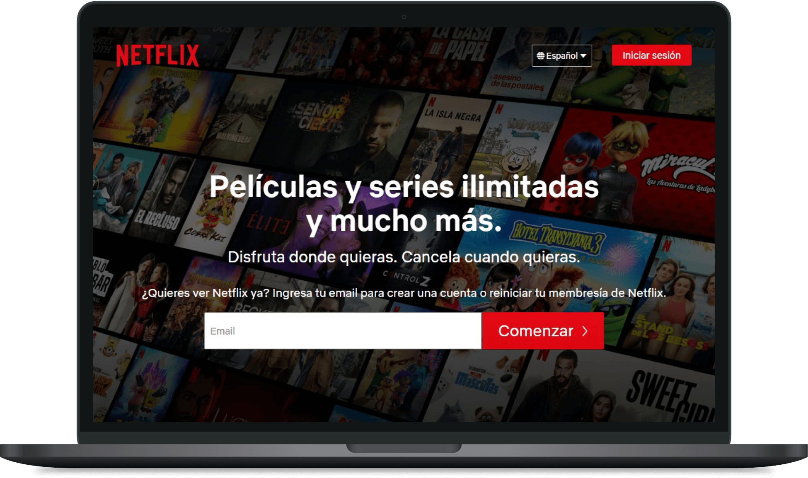

# Netflix Landing Page Clone

[![MIT License][mit-license-image]][mit-license-url]
[![GitHub contributors][contributors]][contributors-url]
![GitHub package.json version][version-url]

This repository contains Netlix Landing Page's front-end code.



> Front-End workflow using HTML, CSS y JavaScript.

## ⚙️ Installation
Clone the repository and once has been cloned, open its location.

```sh
 git clone https://github.com/erwcode/netflix-website.git
```

## 🍻 Contributors

| Name                                                              | Position                                   |
|:------------------------------------------------------------------|:-------------------------------------------|
| [Erwin Alan Frías Martínez](https://github.com/erwinfriasmtz)     | Product Designer & Front-End Developer     |
| [Marcos Felipe Frías Martínez](https://github.com/Marcos-Frias)   | Full-Stack Developer    |

### ⚖️ Copyright and License

Made with 💖 by [ErwCode Technologies](https://erwcode.com/).


[mit-license-image]: https://img.shields.io/github/license/erwinfriasmtz/netflix-website.svg
[mit-license-url]: https://github.com/erwinfriasmtz/netflix-website/blob/master/LICENSE

[contributors]: https://img.shields.io/github/contributors/erwinfriasmtz/netflix-website.svg?color=orange
[contributors-url]: https://github.com/erwinfriasmtz/netflix-website/graphs/contributors

[version-url]: https://img.shields.io/github/package-json/v/erwinfriasmtz/netflix-website.svg?color=red